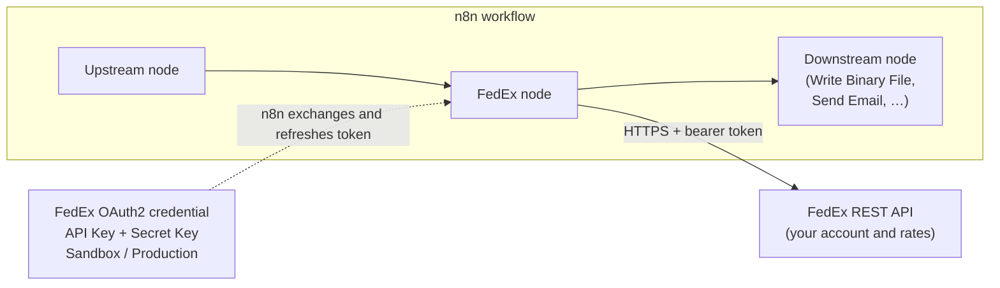
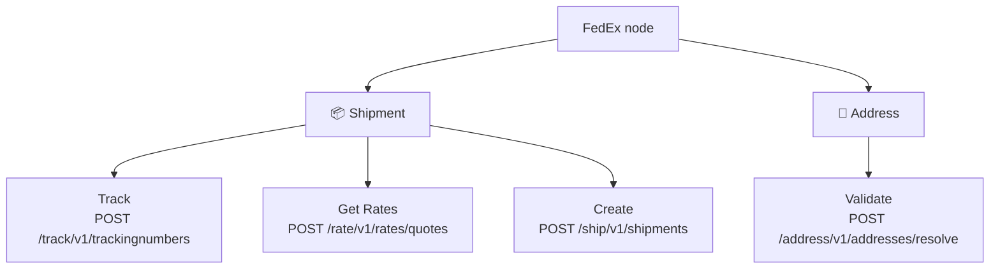
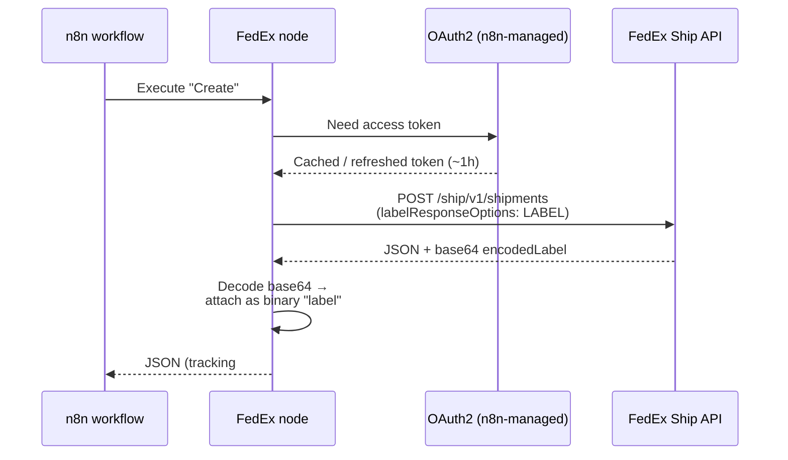

# 📦 n8n-fedex-node

**Use the FedEx REST API directly in your n8n workflows.**

Track shipments · validate addresses · quote rates · create labels — against _your own_ FedEx account, with no aggregator in the middle.

[Installation](#installation) · [Operations](#operations) · [Credentials](#credentials) · [Usage](#usage) · [npm](https://www.npmjs.com/package/@nodrel-dev/n8n-nodes-fedex) · [FedEx Developer Portal](https://developer.fedex.com/) · [Report an issue](https://github.com/nodrel-dev/n8n-fedex-node/issues)

## What is this?

This is an [n8n](https://n8n.io/) community node for the **FedEx REST API**. It lets your workflows track shipments, validate addresses, quote rates, and create shipping labels — talking straight to FedEx with your own API credentials.

Because there's no aggregator in the middle, you get **your own negotiated rates** and FedEx bills your account directly. [n8n](https://n8n.io/) is a [fair-code licensed](https://docs.n8n.io/sustainable-use-license/) workflow automation platform.

### Highlights

- 🚚 **Direct to FedEx** — your API keys, your negotiated rates, your account billed. No aggregator markup or middleman.
- 🏷️ **Labels as real binary** — Create returns a print-ready PDF / PNG / ZPL / EPL label as n8n binary data, not a base64 blob buried in JSON.
- 🔀 **One sandbox / production switch** — a single credential field repoints every API request and the OAuth token URL together, so a call can never straddle environments.
- 🔐 **Native OAuth2, no token code** — n8n performs the client-credentials exchange and refreshes the ~1 hour token for you.
- 📦 **Zero runtime dependencies** — ships only `dist/`, published to npm with signed [provenance](https://docs.npmjs.com/generating-provenance-statements) and scanned on every push by Dependabot and Snyk.

## Who it's for

- **E-commerce & retail** — print labels at fulfillment, surface tracking to customers, and rate-shop services per order.
- **3PLs & fulfillment ops** — automate shipping for many accounts and wire labels into existing pick-and-pack flows.
- **Finance & operations teams** — quote live negotiated rates inside approval and reconciliation workflows.
- **Developers & integrators** — embed FedEx tracking, address validation, and labels into any n8n automation without hand-rolling OAuth.

## How it works

The node sits between your workflow and FedEx. A single **FedEx OAuth2** credential holds your API key/secret and the sandbox-or-production switch; n8n handles the token exchange, and every request is routed to the matching FedEx host.

## Installation

Follow the [installation guide](https://docs.n8n.io/integrations/community-nodes/installation/) in the n8n community nodes documentation. In n8n, go to **Settings → Community Nodes → Install** and enter `@nodrel-dev/n8n-nodes-fedex`.

## Operations

The node exposes two resources: **Shipment** and **Address**.

### Shipment

- **Track** — Get the status and scan history for one or more tracking numbers (`POST /track/v1/trackingnumbers`). Toggle **Track Multiple Numbers** to pass a comma-separated list, and **Include Detailed Scans** for the full scan event history.
- **Get Rates** — Quote negotiated and list rates for available services (`POST /rate/v1/rates/quotes`). Leave **Service Type** as _All Available Services_ to compare every eligible service, or pin a single one. Requires a **Shipping Account Number**. The panel shows a short required core (addresses, weight); optional inputs live under **Additional Fields**.
- **Create** — Buy a shipment and get a printable label plus tracking number (`POST /ship/v1/shipments`). The label is returned as **n8n binary data** (see [Usage](#usage)). Requires a **Shipping Account Number**. **Service Type** defaults to **FedEx Ground**; optional inputs (company, email, packaging, label stock, dimensions, …) live under **Additional Fields**.

### Address

- **Validate** — Standardize an address and classify it residential vs commercial (`POST /address/v1/addresses/resolve`).

## Credentials

You authenticate with a FedEx **API Key** and **Secret Key** using OAuth2 client-credentials. n8n performs the token exchange and refreshes the ~1 hour token automatically — you never handle tokens yourself.

### Prerequisites

1. Create a free account on the [FedEx Developer Portal](https://developer.fedex.com/).
2. Create a project and add the APIs you need (Track, Address Validation, Rate, Ship).
3. The portal issues an **API Key** (client ID) and **Secret Key** (client secret) for both a **test/sandbox** project and, once approved, a **production** project.
4. For Get Rates and Create you also need your FedEx **shipping account number**.

### Two credential types (one per FedEx project)

The FedEx Developer Portal provisions the **Track API** in a different group from the **shipping** APIs (Rate, Ship, Address Validation), so a single portal project usually cannot hold all four — each project issues its own API Key / Secret Key. The node mirrors this with **two credential types**, and each operation automatically uses the right one:

- **FedEx Track OAuth2 API** → from the project that has the Track API → used by **Track**.
- **FedEx Shipping OAuth2 API** → from the project that has Rate + Ship + Address Validation → used by **Get Rates**, **Create**, and **Validate**.

If your portal account provisions all four APIs in one project, use the same API Key / Secret Key in both credentials.

### Set up a credential in n8n

1. Add a new **FedEx Track OAuth2 API** or **FedEx Shipping OAuth2 API** credential (the node shows the right field per operation).
2. Set **Environment** to **Sandbox (Test)** while developing, or **Production (Live)** for real shipments. This single switch points both the OAuth token URL and every API request at the matching FedEx host, so a request can never straddle sandbox and production.
3. Enter your **Client ID** (FedEx API Key) and **Client Secret** (FedEx Secret Key).
4. Save — n8n runs the credential test against that API and shows a green confirmation when the keys are valid.

> **Sandbox vs production:** credentials default to **Sandbox** on purpose, so a half-configured connection can't hit a live account. Switch to **Production** only when you are ready to create real, billable shipments.

### Production: Create (Ship) requires FedEx label certification

Sandbox label creation works immediately. **Production** is different: before FedEx authorizes your production credentials to transmit live label transactions, you must complete the [FedEx Shipper Validation](https://developer.fedex.com/) process — generate sample labels, submit them to the FedEx Bar Code Analysis group, and wait for approval (about a three-business-day turnaround). Approval is **per project**. Track, Get Rates, and Validate do not require this; only Ship does.

## Compatibility

- Requires n8n with `n8nNodesApiVersion: 1`.
- Built and tested against the FedEx REST API (Track v1, Address v1, Rate v1, Ship v1).
- The shipping **account number** is never defaulted or hardcoded — it always comes from the node field, and your API keys live only in the credential.

## Security & dependencies

The published package ships only `dist/` with **zero runtime dependencies** (`n8n-workflow` is a peer, provided by your n8n instance). Any `pnpm audit` / Dependabot findings are confined to the build, test, and release tooling or the host-provided peer — none of them reach an installed node. Outstanding upstream advisories (waiting on newer `@n8n/node-cli` and `n8n-workflow` releases) are tracked in [#2](https://github.com/nodrel-dev/n8n-fedex-node/issues/2).

The repository is continuously scanned for vulnerabilities by both **Dependabot** and **[Snyk](https://snyk.io/)** — Snyk checks dependencies and source on every push and pull request, so each release commit is scanned before it ships.

Every release is published to npm with a signed **[provenance](https://docs.npmjs.com/generating-provenance-statements) attestation** through GitHub Actions [OIDC trusted publishing](https://docs.npmjs.com/trusted-publishers): no long-lived npm token is stored in the repo, and anyone can cryptographically verify that a given version was built by this workflow from this exact commit (see the **Provenance** panel on the [npm page](https://www.npmjs.com/package/@nodrel-dev/n8n-nodes-fedex)).

## Usage

### Get Rates and Create

Both operations share the same **Shipper** and **Recipient** address/contact fields, so values carry over when you switch between them.

Only the fields a shipment genuinely needs sit flat at the top of the panel — addresses, contact name and phone, weight, and (for Create) service and label format. Everything optional is grouped under a single **Additional Fields** collection: company name, email, the **Recipient Is Residential** flag, **Pickup Type**, **Packaging Type**, **Label Stock Type**, and parcel dimensions. Add only what you need; anything you leave out falls back to the same FedEx default it always used. Package dimensions (length/width/height) are still only sent to FedEx when all three are greater than zero.

### The label binary (Create)

Create returns the label as proper n8n **binary data** on the output property named `label` — not a base64 string buried in JSON. Under the hood, the node requests an inline base64 label, decodes it, and attaches it as binary so downstream nodes can print or save it directly:

Choose the format with **Label Format**:

| Label Format | MIME type | Typical use |
|---|---|---|
| PDF | `application/pdf` | Office printers |
| PNG | `image/png` | Preview / embedding |
| Thermal (ZPLII) | `application/octet-stream` | Zebra thermal printers |
| Thermal (EPL2) | `application/octet-stream` | Eltron thermal printers |

The tracking number and rate details are passed through on the main JSON output. Wire the `label` binary into **Write Binary File**, **Send Email** (as an attachment), or any node that consumes binary data.

### Errors and Continue On Fail

FedEx error messages (`errors[].message`) are surfaced directly through n8n's error handling, and the node honors **Continue On Fail** — failed items emit an `error` entry and the workflow keeps processing the rest.

## Documentation

Deeper docs for contributors and integrators live in [`docs/`](docs/):

- [System Overview](docs/system-overview.md) — architecture, auth/environment model, request lifecycle (with diagrams).
- [Integration Specification](docs/integration-spec.md) — endpoints, request/response shapes, enums, and error handling for all four operations.
- [Data Model](docs/data-model.md) — the typed shapes the node assembles, and the node-parameter → FedEx-field mapping.
- [Architecture Decision Records](docs/adr/) — why the key design choices were made.

## Resources

- [n8n community nodes documentation](https://docs.n8n.io/integrations/#community-nodes)
- [FedEx Developer Portal](https://developer.fedex.com/)
- [FedEx API documentation](https://developer.fedex.com/api/en-us/catalog.html)

## Version history

See [CHANGELOG.md](CHANGELOG.md) for the full, per-release history (kept current automatically on each release).
