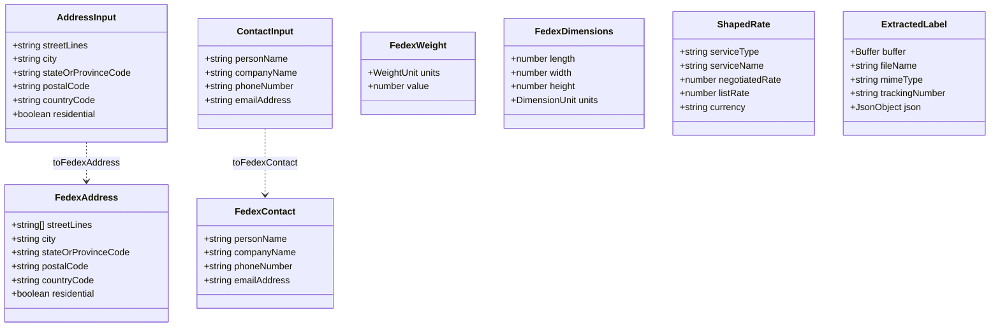
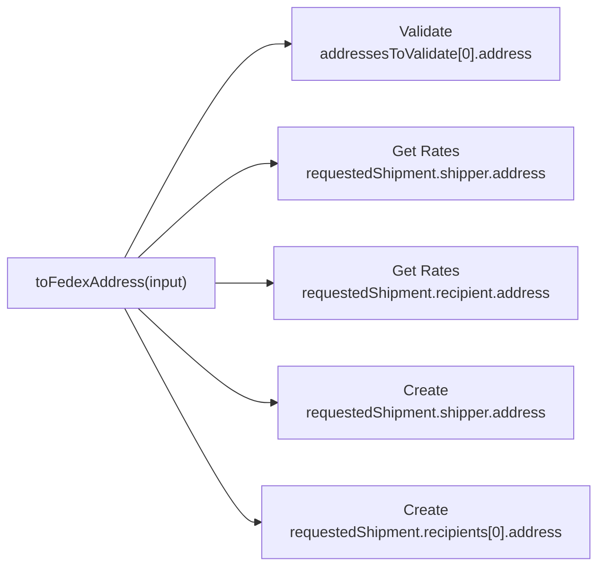

# Data Model — n8n-nodes-fedex

> Audience: contributors. These are the typed shapes the pure cores assemble from node parameters
> and the shapes they emit. See [Integration Specification](integration-spec.md) for how each shape
> sits inside a request/response, and the [System Overview](system-overview.md) for the architecture.

The node has no database. "Data model" here means the in-memory shapes that flow from n8n node
parameters → pure cores → FedEx request bodies, and from FedEx responses → pure cores → n8n output.
The typed shapes live in
[cores/fedexTypes.ts](https://github.com/nodrel-dev/n8n-fedex-node/blob/main/nodes/Fedex/cores/fedexTypes.ts);
they are deliberately free of any n8n coupling so the cores stay unit-testable
([ADR-0003](adr/0003-pure-assembly-cores-with-unit-test-runner.md)).

## Shapes

### Inputs versus FedEx shapes

`AddressInput` / `ContactInput` are the loose, flat values read from node parameters;
`FedexAddress` / `FedexContact` are the cleaned shapes FedEx expects. The cores own the rules:

- **`toFedexAddress`** splits Street Lines on newlines (max 3), trims everything, defaults
  `countryCode` to `US`, includes `stateOrProvinceCode` only when present, and includes
  `residential` only when it was explicitly provided (it is meaningful for a recipient, omitted
  elsewhere).
- **`toFedexContact`** always carries a trimmed `phoneNumber` and omits blank identity fields.

### Output shapes

- **`ShapedRate`** is one flattened row per service produced by `shapeRates` from
  `output.rateReplyDetails`. `negotiatedRate` is the account (`ACCOUNT`) price; `listRate` is the
  published (`LIST`) price; either can be `null`.
- **`ExtractedLabel`** is produced by `extractLabel`: the decoded label `buffer`, a sanitized
  `fileName`, the `mimeType` from the chosen format, the `trackingNumber`, and `json` — the FedEx
  output with every base64 `encodedLabel` recursively stripped.

## Node parameter → FedEx field mapping

"Surface" is where the operator enters the value: **Flat** = a top-level field; **Additional Fields**
= an entry inside the single optional `additionalFields` collection (see
[fields.ts](https://github.com/nodrel-dev/n8n-fedex-node/blob/main/nodes/Fedex/fields.ts)).

| Node parameter | FedEx field (via core) | Surface | Used by |
| -------------- | ---------------------- | ------- | ------- |
| `{role}StreetLines` | `address.streetLines[]` (split, max 3) | Flat | Validate, Get Rates, Create |
| `{role}City` | `address.city` | Flat | Validate, Get Rates, Create |
| `{role}StateOrProvinceCode` | `address.stateOrProvinceCode` (omitted if blank) | Flat | Validate, Get Rates, Create |
| `{role}PostalCode` | `address.postalCode` | Flat | Validate, Get Rates, Create |
| `{role}CountryCode` | `address.countryCode` (default `US`) | Flat | Validate, Get Rates, Create |
| `recipientResidential` | `address.residential` (recipient only) | Additional Fields | Get Rates, Create |
| `{role}PersonName` | `contact.personName` | Flat | Create |
| `{role}CompanyName` | `contact.companyName` | Additional Fields | Create |
| `{role}PhoneNumber` | `contact.phoneNumber` (required) | Flat | Create |
| `{role}EmailAddress` | `contact.emailAddress` | Additional Fields | Create |
| `shippingAccountNumber` | `accountNumber.value` (required) | Flat | Get Rates, Create |
| `packageWeight` / `weightUnit` | `requestedPackageLineItems[0].weight` | Flat | Get Rates, Create |
| `packageLength/Width/Height` / `dimensionUnit` | `requestedPackageLineItems[0].dimensions` (sent only when all three greater than 0) | Additional Fields | Get Rates, Create |
| `pickupType` | `requestedShipment.pickupType` (default `USE_SCHEDULED_PICKUP`) | Additional Fields | Get Rates, Create |
| `packagingType` | `requestedShipment.packagingType` (default `YOUR_PACKAGING`) | Additional Fields | Create |
| `serviceType` | `requestedShipment.serviceType` | Flat | Get Rates (optional), Create (required, default `FEDEX_GROUND`) |
| `labelImageType` | `labelSpecification.imageType` + binary MIME | Flat | Create |
| `labelStockType` | `labelSpecification.labelStockType` (default `PAPER_4X6`) | Additional Fields | Create |

`{role}` is `shipper` or `recipient`; the same builders are reused across Get Rates and Create so
values carry over when switching operation.

The **Additional Fields** rows live inside one optional `additionalFields` collection rather than as
flat fields, so the panel reads as a short required core instead of a ~30-field wall. Because a
collection only returns the entries the user actually added, the per-field defaults are **not**
auto-materialized; the readers in
[resources/shared.ts](https://github.com/nodrel-dev/n8n-fedex-node/blob/main/nodes/Fedex/resources/shared.ts)
(`readAdditional`, `pickString`, `pickNumber`) re-apply the same defaults the old flat fields carried,
so the assembled FedEx request body is unchanged.

## The one-Address, four-positions crux

The single `FedexAddress` shape lands in four structurally different request positions. This is the
core reason address assembly is a pure function rather than per-field declarative routing
([ADR-0003](adr/0003-pure-assembly-cores-with-unit-test-runner.md)):

Two of those carry an array index, `recipient` is singular for Get Rates but a plural `recipients`
array for Create, and `residential` is a user **input** for a recipient but the **output** of
Validate. One pure core normalizes all of it.

## Traceability to repo artifacts

| Shape / logic | Source |
| ------------- | ------ |
| Typed FedEx shapes | [cores/fedexTypes.ts](https://github.com/nodrel-dev/n8n-fedex-node/blob/main/nodes/Fedex/cores/fedexTypes.ts) |
| Address assembly | [cores/toFedexAddress.ts](https://github.com/nodrel-dev/n8n-fedex-node/blob/main/nodes/Fedex/cores/toFedexAddress.ts) |
| Contact assembly | [cores/toFedexContact.ts](https://github.com/nodrel-dev/n8n-fedex-node/blob/main/nodes/Fedex/cores/toFedexContact.ts) |
| Rate shaping | [cores/shapeRates.ts](https://github.com/nodrel-dev/n8n-fedex-node/blob/main/nodes/Fedex/cores/shapeRates.ts) |
| Label extraction | [cores/extractLabel.ts](https://github.com/nodrel-dev/n8n-fedex-node/blob/main/nodes/Fedex/cores/extractLabel.ts) |
| Parameter readers | [resources/shared.ts](https://github.com/nodrel-dev/n8n-fedex-node/blob/main/nodes/Fedex/resources/shared.ts) |
| Field builders | [fields.ts](https://github.com/nodrel-dev/n8n-fedex-node/blob/main/nodes/Fedex/fields.ts) |
