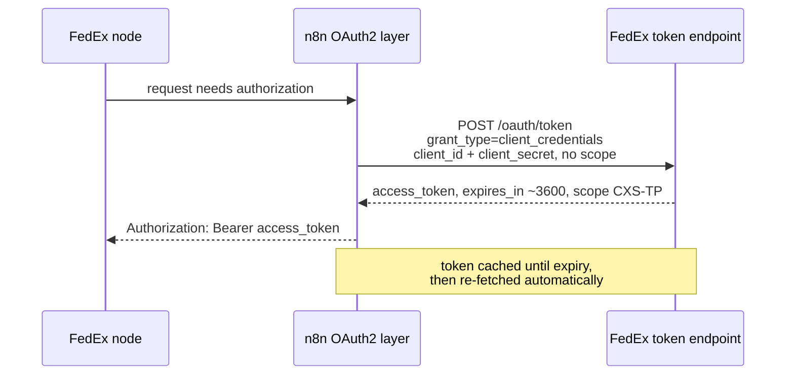

# Integration Specification — n8n-nodes-fedex

> Audience: contributors and integrators who need the exact endpoints, request/response shapes, and
> transforms. For the bigger picture, see the [System Overview](system-overview.md); for typed
> shapes, see the [Data Model](data-model.md).

All requests share `requestDefaults`: `Accept: application/json`, `Content-Type: application/json`,
and a `baseURL` that follows the credential's Environment field —
`https://apis-sandbox.fedex.com` (sandbox) or `https://apis.fedex.com` (production).

## Authentication

Both credentials extend n8n's built-in `oAuth2Api` with `grantType: clientCredentials`. n8n runs the
token exchange and refreshes the ~1 hour token; the node never handles tokens directly.



Key facts:

- **`client_id` / `client_secret`** map to the FedEx **API Key** / **Secret Key**.
- **No scope.** FedEx derives scope from the client registration and returns HTTP 400 if an explicit
  `scope` is sent. The credential sends an empty scope.
- **Token URL follows Environment**: `…/oauth/token` on the sandbox or production host.
- **Two credentials, disjoint entitlements.** The FedEx portal provisions Track in one project and
  Rate/Ship/Address-Validation in another; each issues its own key pair. A token from one project
  returns HTTP 403 on the other's endpoints, so:

| Credential type          | Used by                     | Credential test endpoint            |
| ------------------------ | --------------------------- | ----------------------------------- |
| `fedexTrackOAuth2Api`    | Track                       | `POST /track/v1/trackingnumbers`    |
| `fedexShippingOAuth2Api` | Get Rates, Create, Validate | `POST /address/v1/addresses/resolve`|

## Operations

### Track

| | |
| --- | --- |
| Resource / Operation | Tracking / `track` |
| Method + URL | `POST /track/v1/trackingnumbers` |
| Credential | `fedexTrackOAuth2Api` |
| Transform | `trackPreSend` (request); response passes through unchanged |

**Inputs**

| Field | Type | Notes |
| ----- | ---- | ----- |
| Track Multiple Numbers | boolean | Toggles single vs multi input |
| Tracking Number | string | When not multiple |
| Tracking Numbers | string | When multiple; one per line or comma-separated |
| Include Detailed Scans | boolean | Default true; off for status-only |

**Request body**

```json
{
  "includeDetailedScans": true,
  "trackingInfo": [
    { "trackingNumberInfo": { "trackingNumber": "128667043726" } }
  ]
}
```

`trackPreSend` splits multi input on newlines/commas, trims, drops blanks, and throws a
`NodeOperationError` if no tracking number remains.

**Output:** the raw FedEx tracking JSON (no `postReceive`).

### Validate

| | |
| --- | --- |
| Resource / Operation | Shipping / `validate` |
| Method + URL | `POST /address/v1/addresses/resolve` |
| Credential | `fedexShippingOAuth2Api` |
| Transform | `validatePreSend` (request); declarative `rootProperty` (response) |

**Inputs:** Street Lines, City, State/Province Code, Postal Code, Country Code (default `US`). No
Shipping Account is needed.

**Request body**

```json
{
  "addressesToValidate": [
    { "address": { "streetLines": ["…"], "city": "…", "postalCode": "…", "countryCode": "US" } }
  ]
}
```

The address is built by the shared `toFedexAddress` core (street split, US default, no `residential`
flag for Validate).

**Output:** `output.resolvedAddresses` is lifted to the item root via a declarative `rootProperty`
transform, so each resolved/standardized address (with residential vs commercial classification) is
emitted directly.

### Get Rates

| | |
| --- | --- |
| Resource / Operation | Shipping / `getRates` |
| Method + URL | `POST /rate/v1/rates/quotes` |
| Credential | `fedexShippingOAuth2Api` |
| Transform | `getRatesPreSend` (request) + `getRatesPostReceive` → `shapeRates` (response) |

**Inputs:** Shipping Account Number (required), shipper address, recipient address (+ residential),
pickup type, service type (optional — blank asks for all services), package weight/unit and optional
dimensions.

**Request body**

```json
{
  "accountNumber": { "value": "<account>" },
  "rateRequestControlParameters": { "returnTransitTimes": true },
  "requestedShipment": {
    "shipper": { "address": { "…": "…" } },
    "recipient": { "address": { "…": "…" } },
    "pickupType": "USE_SCHEDULED_PICKUP",
    "rateRequestType": ["ACCOUNT", "LIST"],
    "requestedPackageLineItems": [ { "weight": { "units": "LB", "value": 1 } } ]
  }
}
```

`rateRequestType: ["ACCOUNT", "LIST"]` asks FedEx for both the negotiated and published prices.
`serviceType` is included only when set.

**Output (after `shapeRates`)** — one item per service:

```json
{
  "serviceType": "FEDEX_GROUND",
  "serviceName": "FedEx Ground",
  "negotiatedRate": 12.34,
  "listRate": 18.90,
  "currency": "USD"
}
```

`shapeRates` flattens `output.rateReplyDetails`, pairing the `ACCOUNT` rate (negotiated) against the
`LIST` rate per service. If FedEx returns only one rate type, the available price is still surfaced
as `negotiatedRate`; missing values are `null`.

### Create

| | |
| --- | --- |
| Resource / Operation | Shipping / `create` |
| Method + URL | `POST /ship/v1/shipments` |
| Credential | `fedexShippingOAuth2Api` |
| Transform | `createPreSend` (request) + `createPostReceive` → `extractLabel` (response) |

**Inputs:** Shipping Account Number (required), shipper address + contact, recipient address (+
residential) + contact, service type (required), packaging type, pickup type, package
weight/dimensions, **Label Format** (`imageType`), **Label Stock Type**.

**Request body (abridged)**

```json
{
  "labelResponseOptions": "LABEL",
  "accountNumber": { "value": "<account>" },
  "requestedShipment": {
    "shipper": { "address": { "…": "…" }, "contact": { "…": "…" } },
    "recipients": [ { "address": { "…": "…" }, "contact": { "…": "…" } } ],
    "serviceType": "FEDEX_GROUND",
    "packagingType": "YOUR_PACKAGING",
    "pickupType": "USE_SCHEDULED_PICKUP",
    "shippingChargesPayment": { "paymentType": "SENDER" },
    "labelSpecification": {
      "imageType": "PDF",
      "labelStockType": "PAPER_4X6",
      "labelFormatType": "COMMON2D"
    },
    "requestedPackageLineItems": [ { "weight": { "units": "LB", "value": 1 } } ]
  }
}
```

Note the structural difference from Get Rates: Create uses `recipients` as an **array**, Get Rates
uses a singular `recipient`. `shippingChargesPayment` is always `SENDER` in v1. `labelResponseOptions: LABEL`
asks FedEx to inline the base64 label rather than a URL.

**Output (after `extractLabel`)**

- `json`: the shipment output with `trackingNumber` plus all FedEx detail, with every base64
  `encodedLabel` recursively **stripped** so the JSON never carries the blob.
- `binary.label`: the decoded label file. FedEx returns the label at
  `output.transactionShipments[].pieceResponses[].packageDocuments[].encodedLabel`. `extractLabel`
  decodes it to a Buffer, names it `label-<trackingNumber>.<ext>` (tracking number sanitized to safe
  filename characters), and sets the MIME type from the chosen format.

## Enums and the label MIME map

**Service types** (`serviceType`; free string in the spec, these are the exposed domestic values):
`FEDEX_GROUND`, `GROUND_HOME_DELIVERY`, `FEDEX_EXPRESS_SAVER`, `FEDEX_2_DAY`, `FEDEX_2_DAY_AM`,
`STANDARD_OVERNIGHT`, `PRIORITY_OVERNIGHT`, `FIRST_OVERNIGHT`.

**Packaging types:** `YOUR_PACKAGING`, `FEDEX_ENVELOPE`, `FEDEX_PAK`, `FEDEX_SMALL_BOX`,
`FEDEX_MEDIUM_BOX`, `FEDEX_LARGE_BOX`, `FEDEX_EXTRA_LARGE_BOX`, `FEDEX_TUBE`.

**Pickup types:** `USE_SCHEDULED_PICKUP`, `DROPOFF_AT_FEDEX_LOCATION`, `CONTACT_FEDEX_TO_SCHEDULE`.

**Label stock types:** `PAPER_4X6`, `PAPER_4X8`, `PAPER_LETTER`, `STOCK_4X675`, `STOCK_4X8`.

**Label image type → binary MIME / extension:**

| `imageType` | MIME | Extension |
| ----------- | ---- | --------- |
| `PDF`   | `application/pdf`          | `pdf` |
| `PNG`   | `image/png`               | `png` |
| `ZPLII` | `application/octet-stream`| `zpl` |
| `EPL2`  | `application/octet-stream`| `epl` |

## Error handling

- FedEx errors are surfaced from `errors[].message` through `NodeApiError` / `NodeOperationError` —
  the operator sees the real FedEx reason.
- Boundary validations throw before the request: at least one tracking number (Track), a non-empty
  Shipping Account Number (Get Rates, Create), and a present `encodedLabel` (Create).
- All operations honor n8n's **Continue On Fail**: a failing item produces a JSON error entry
  instead of aborting the whole execution.

## Traceability to repo artifacts

| Operation / concern | Source |
| ------------------- | ------ |
| Track | [resources/tracking/track.ts](https://github.com/nodrel-dev/n8n-fedex-node/blob/main/nodes/Fedex/resources/tracking/track.ts) |
| Get Rates | [resources/shipping/getRates.ts](https://github.com/nodrel-dev/n8n-fedex-node/blob/main/nodes/Fedex/resources/shipping/getRates.ts) |
| Create | [resources/shipping/create.ts](https://github.com/nodrel-dev/n8n-fedex-node/blob/main/nodes/Fedex/resources/shipping/create.ts) |
| Validate | [resources/shipping/validate.ts](https://github.com/nodrel-dev/n8n-fedex-node/blob/main/nodes/Fedex/resources/shipping/validate.ts) |
| Operation routing (URLs, transforms) | [resources/shipping/index.ts](https://github.com/nodrel-dev/n8n-fedex-node/blob/main/nodes/Fedex/resources/shipping/index.ts) |
| Enums + MIME map | [constants.ts](https://github.com/nodrel-dev/n8n-fedex-node/blob/main/nodes/Fedex/constants.ts), [cores/extractLabel.ts](https://github.com/nodrel-dev/n8n-fedex-node/blob/main/nodes/Fedex/cores/extractLabel.ts) |
| Parameter readers + validations | [resources/shared.ts](https://github.com/nodrel-dev/n8n-fedex-node/blob/main/nodes/Fedex/resources/shared.ts) |
