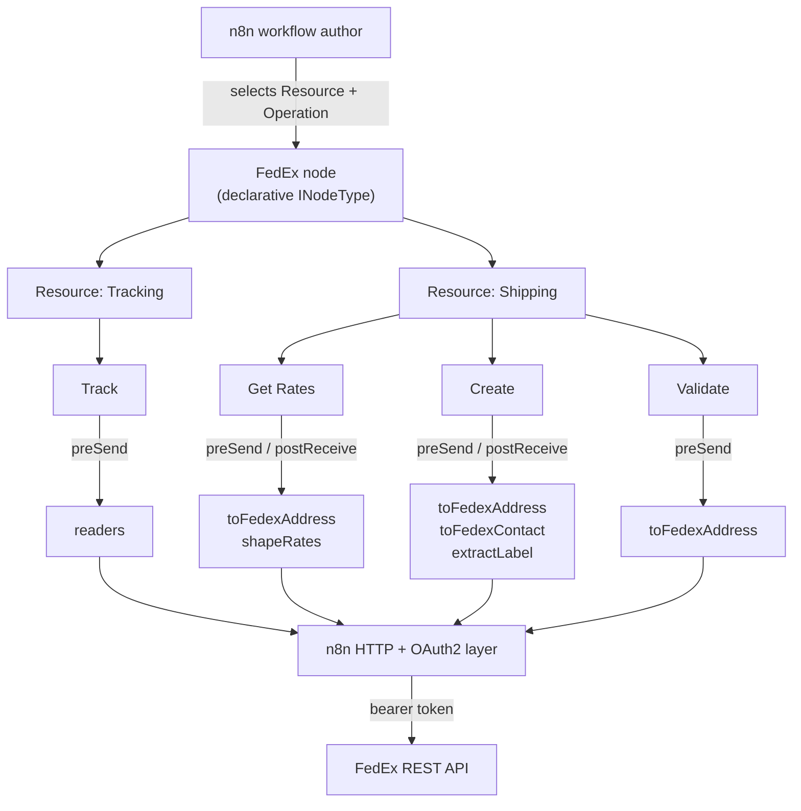
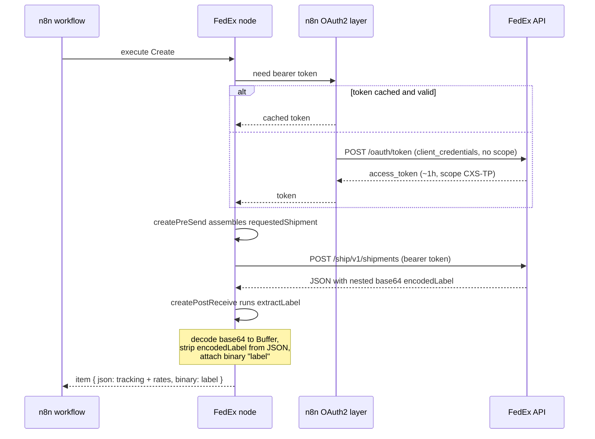

# System Overview — n8n-nodes-fedex

> Audience: contributors and integrators. For installation and usage, see the
> [README](../README.md). For the per-operation request/response reference, see
> [Integration Specification](integration-spec.md). For the typed shapes, see
> [Data Model](data-model.md).

## Business purpose

`n8n-nodes-fedex` is an [n8n](https://n8n.io/) community node that calls the **FedEx REST API
directly** — no shipping aggregator in between. A business uses its **own** FedEx API credentials
and account number, so workflows quote the account's **negotiated rates**, and FedEx bills that
account directly. The node packages four FedEx capabilities as n8n operations: track a shipment,
validate an address, quote rates, and create a shipment with a printable label.

The differentiator versus a generic HTTP Request node is that the messy parts are handled: native
OAuth2 token exchange, a single sandbox/production switch that moves the token URL and every API
call together, and a shipping label returned as real n8n **binary** data (a print-ready PDF/PNG/ZPL
file) instead of a base64 string buried in JSON.

## Scope

In scope:

- Four operations across two resources (see below).
- OAuth2 `client_credentials` authentication via n8n's built-in credential layer.
- Sandbox and production environments behind one credential field.
- Request assembly and response reshaping for the four operations.

Out of scope (v1):

- FedEx capabilities beyond the four operations (pickups, freight, consolidation, locations, etc.).
- Webhooks/push tracking — the node is request/response only.
- Payor models other than `SENDER` for Create (the configured Shipping Account is always billed).
- Storing or rotating credentials — that is n8n's responsibility.

## Functional behavior

The node is a single declarative n8n node (`displayName: "FedEx"`, internal name `fedex`). The user
picks a **Resource**, then an **Operation**; n8n shows the fields for that operation and, on
execute, routes the request to the matching FedEx endpoint. The node is also exposed as an AI agent
tool (`usableAsTool: true`).

Resources mirror the two FedEx developer-portal **projects**, because each project issues its own
credential and the two have disjoint entitlements (a token for one returns HTTP 403 on the other —
see [ADR-0004](adr/0004-resources-mirror-fedex-projects.md)):

| Resource     | Operations                  | Credential               | FedEx project |
| ------------ | --------------------------- | ------------------------ | ------------- |
| **Tracking** | Track                       | `fedexTrackOAuth2Api`    | Track         |
| **Shipping** | Get Rates, Create, Validate | `fedexShippingOAuth2Api` | Shipping      |

Credentials are bound per **operation** (operation values are globally unique), so n8n requests the
correct key for whichever operation is selected.

### Architecture

The node stays **declarative**: each operation declares its HTTP method and URL, and the
request/response work that routing cannot express is done in small, pure functions ("cores") behind
thin `preSend`/`postReceive` adapters (see [ADR-0003](adr/0003-pure-assembly-cores-with-unit-test-runner.md)).
The cores know nothing about n8n, so they are unit-tested in isolation.

### Authentication and environment model

Both credential types `extend` n8n's built-in `oAuth2Api` with `grantType: clientCredentials`, so
n8n performs the token exchange and caches/refreshes the (~1 hour) token natively — there is no
hand-rolled token code. The shared OAuth configuration lives in
`credentials/fedexOAuth2Shared.ts`; each credential class adds only its own credential `test`
request against an endpoint it is entitled to call.

Two FedEx-specific rules are encoded here:

- **Scope must be empty.** FedEx's `client_credentials` flow derives scope from the client's
  registration and rejects an explicit `scope` parameter with HTTP 400. The credential sends no
  scope; FedEx returns the effective scope (for example `CXS-TP`) on success.
- **One environment switch.** A single `Environment` dropdown (`sandbox` default, or `production`)
  drives both the OAuth `accessTokenUrl` and the node's `requestDefaults.baseURL`, so token exchange
  and API calls can never target different hosts (see
  [ADR-0001](adr/0001-single-credential-environment-switch.md)). Defaulting to sandbox keeps a
  half-configured connection — or an unattended AI agent — off a live account.

### Request lifecycle

Create is the richest path: its `preSend` assembles the shipment body, and its `postReceive`
decodes the base64 label into binary (see
[ADR-0002](adr/0002-declarative-node-postreceive-label-binary.md)).

## Data inputs and outputs

| Operation | Key inputs | Output |
| --------- | ---------- | ------ |
| Track     | One or many tracking numbers; detailed-scans flag | FedEx tracking JSON (passthrough) |
| Validate  | An address | Resolved/standardized addresses (`output.resolvedAddresses`) |
| Get Rates | Account number, shipper + recipient address, package, optional service | One JSON row per service: negotiated rate, list rate, currency |
| Create    | Account number, shipper + recipient address + contact, package, label format | JSON (tracking number, shipment details) plus a binary label file |

Field-by-field shapes are in the [Data Model](data-model.md). Endpoint and body details are in the
[Integration Specification](integration-spec.md).

## Dependencies

- **n8n** runtime (`n8n-workflow` peer types; the OAuth2 and binary helpers).
- **FedEx REST API** — `apis-sandbox.fedex.com` (sandbox) and `apis.fedex.com` (production).
- **Zero runtime npm dependencies.** The package ships only `dist/`. `vitest` is a dev-only
  dependency for the core unit tests.

## Risks and failure modes

- **Wrong credential per project.** Using the Track key on a Shipping operation (or vice versa)
  returns HTTP 403. Mitigation: per-operation credential binding plus a credential `test` on each
  type that hits an entitled endpoint, so a wrong key fails the connection test rather than mid-run.
- **Explicit scope.** Any non-empty scope breaks token exchange (HTTP 400). The credential forces an
  empty scope.
- **Missing account number.** Get Rates and Create fail fast with a clear error if the Shipping
  Account Number is blank (`requireAccountNumber`).
- **No label returned.** If FedEx returns no `encodedLabel` (for example, `labelResponseOptions`
  not set to `LABEL`), `extractLabel` throws a descriptive error rather than emitting an empty file.
- **Oversized label.** A decoded label larger than 20 MB is rejected defensively (`MAX_LABEL_BYTES`).
- **Production label certification.** FedEx requires the Create operation's sample labels to pass its
  Bar Code Analysis review before production credentials may transmit live label transactions
  (~3 business days, per project). Sandbox label creation works immediately; Track/Get Rates/Validate
  are exempt.

## Monitoring and support implications

- The node honors n8n's **Continue On Fail**: when enabled, a failing item yields a JSON error entry
  instead of aborting the whole execution.
- FedEx errors are surfaced from `errors[].message` via `NodeApiError`/`NodeOperationError`, so the
  operator sees the real FedEx reason, not a generic failure.
- There is no server to operate — the node runs inside the user's n8n instance. "Support" is mostly
  credential setup (two projects, two credentials) and, for production Create, label certification.

## Assumptions and unknowns

- **Assumption:** the four FedEx endpoints and their field names remain stable at the documented v1
  paths. They were verified against the captured OpenAPI specs and a live sandbox round-trip on
  2026-06-14.
- **Assumption:** the common domestic service-type and label enums exposed by the node cover the
  typical use case; `serviceType` is a free string in the FedEx spec, so other values are possible.
- **Unknown:** international shipping fields (customs/commodities) are not modeled in v1.

## Open questions

- Should additional FedEx services (pickup scheduling, international customs) become future
  operations or a separate node?
- Should the node expose alternate payor models for Create, or stay `SENDER`-only?

## Traceability to repo artifacts

| Concern | Source |
| ------- | ------ |
| Node definition, resources, credential binding, base URL | [Fedex.node.ts](https://github.com/nodrel-dev/n8n-fedex-node/blob/main/nodes/Fedex/Fedex.node.ts) |
| Shared OAuth config + environment switch | [fedexOAuth2Shared.ts](https://github.com/nodrel-dev/n8n-fedex-node/blob/main/credentials/fedexOAuth2Shared.ts) |
| Track credential | [FedexTrackOAuth2Api.credentials.ts](https://github.com/nodrel-dev/n8n-fedex-node/blob/main/credentials/FedexTrackOAuth2Api.credentials.ts) |
| Shipping credential | [FedexShippingOAuth2Api.credentials.ts](https://github.com/nodrel-dev/n8n-fedex-node/blob/main/credentials/FedexShippingOAuth2Api.credentials.ts) |
| Shipping operations routing | [resources/shipping/index.ts](https://github.com/nodrel-dev/n8n-fedex-node/blob/main/nodes/Fedex/resources/shipping/index.ts) |
| Label extraction core | [cores/extractLabel.ts](https://github.com/nodrel-dev/n8n-fedex-node/blob/main/nodes/Fedex/cores/extractLabel.ts) |
| Rate reshaping core | [cores/shapeRates.ts](https://github.com/nodrel-dev/n8n-fedex-node/blob/main/nodes/Fedex/cores/shapeRates.ts) |
| Architecture decisions | [docs/adr/](https://github.com/nodrel-dev/n8n-fedex-node/blob/main/docs/adr) |
